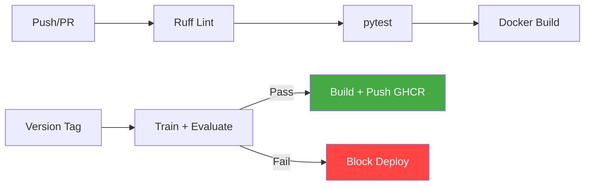

# mlops-serving

[](https://github.com/jstilb/mlops-serving/actions/workflows/test.yml)
[](https://www.python.org/downloads/)
[](https://fastapi.tiangolo.com/)
[](https://www.docker.com/)
[](LICENSE)

Production model serving system with FastAPI, versioned model registry, A/B testing, shadow deployment, data drift detection, and full monitoring stack.

## Why I Built This

Training a model is 10% of the work. The other 90% -- serving, monitoring, versioning, rollbacks, A/B testing -- is what MLOps is about. Most portfolio projects stop at `model.predict()`. This project demonstrates the full production serving layer: containerized inference with health checks, latency monitoring, model version management, shadow deployment for safe validation, and CI/CD with automated evaluation gates.

## Architecture

```mermaid
graph TB
    Client[Client] --> LB[Load Balancer]
    LB --> API[FastAPI App]

    subgraph "API Layer"
        API --> MW1[Request Logging MW]
        MW1 --> MW2[Metrics MW]
        MW2 --> Router[Router]
    end

    Router --> Predict[/predict]
    Router --> Health[/health /ready]
    Router --> Models[/models]

    Predict --> AB[A/B Test Manager]
    AB --> |Control| P1[Predictor]
    AB --> |Treatment| P2[Predictor]

    P1 --> Loader[Model Loader + Cache]
    P2 --> Loader
    P1 --> Drift[Drift Detector]

    Loader --> Registry[Model Registry]
    Registry --> FS[(File System)]

    subgraph "Monitoring"
        MW2 --> Prom[Prometheus]
        P1 --> Prom
        Drift --> Prom
        Prom --> Graf[Grafana]
    end

    style API fill:#009688,color:#fff
    style Prom fill:#e6522c,color:#fff
    style Graf fill:#f46800,color:#fff
    style Registry fill:#2196F3,color:#fff
```

### Request Flow

1. Request arrives with trace ID assignment
2. Logging middleware records method, path, timing
3. Metrics middleware instruments HTTP counters
4. A/B test manager assigns variant (if test active)
5. Predictor loads model from cache, runs inference
6. Drift detector observes feature distributions
7. Response returns with predictions, probabilities, and latency

## Quick Start

### Docker Compose (Recommended)

```bash
# Clone and start the full stack
git clone https://github.com/jstilb/mlops-serving.git
cd mlops-serving

# Start API + Prometheus + Grafana
docker-compose up --build

# Services:
#   API:        http://localhost:8000/docs
#   Prometheus: http://localhost:9090
#   Grafana:    http://localhost:3000 (admin/mlops-demo)
```

The API auto-trains a Wine classification model on first start.

### Local Development

```bash
python -m venv .venv && source .venv/bin/activate
pip install -e ".[dev]"
uvicorn src.api.app:app --reload --port 8000
```

## API Reference

### Predictions

```bash
# Single prediction
curl -X POST http://localhost:8000/api/v1/predict \
  -H "Content-Type: application/json" \
  -d '{
    "features": [[13.0, 1.5, 2.3, 15.0, 110.0, 2.5, 2.8, 0.3, 1.5, 5.0, 1.0, 3.0, 1000.0]]
  }'

# Batch prediction
curl -X POST http://localhost:8000/api/v1/predict \
  -H "Content-Type: application/json" \
  -d '{
    "features": [
      [13.0, 1.5, 2.3, 15.0, 110.0, 2.5, 2.8, 0.3, 1.5, 5.0, 1.0, 3.0, 1000.0],
      [12.0, 2.0, 2.0, 20.0, 90.0, 2.0, 2.0, 0.4, 1.0, 4.0, 0.8, 2.5, 800.0]
    ],
    "include_probabilities": true
  }'
```

**Response:**
```json
{
  "predictions": [0],
  "probabilities": [[0.92, 0.05, 0.03]],
  "model_id": "default",
  "model_version": "v1.0",
  "latency_ms": 2.34
}
```

### Health Checks

```bash
# Liveness probe
curl http://localhost:8000/health

# Readiness probe (checks model availability)
curl http://localhost:8000/ready
```

### Model Management

```bash
# List all models
curl http://localhost:8000/api/v1/models

# Get specific model version
curl http://localhost:8000/api/v1/models/default/v1.0

# Promote a model version
curl -X POST http://localhost:8000/api/v1/models/default/promote \
  -H "Content-Type: application/json" \
  -d '{"model_id": "default", "version": "v2.0", "to_status": "active"}'
```

### A/B Testing

```bash
# Create an A/B test
curl -X POST http://localhost:8000/api/v1/models/ab-tests \
  -H "Content-Type: application/json" \
  -d '{
    "model_id": "default",
    "control_version": "v1.0",
    "treatment_version": "v2.0",
    "traffic_split": 0.2,
    "name": "rf-depth-experiment"
  }'

# Predictions automatically route through the A/B test
curl -X POST http://localhost:8000/api/v1/predict \
  -H "Content-Type: application/json" \
  -d '{
    "features": [[13.0, 1.5, 2.3, 15.0, 110.0, 2.5, 2.8, 0.3, 1.5, 5.0, 1.0, 3.0, 1000.0]],
    "request_id": "user-123"
  }'

# List active tests
curl http://localhost:8000/api/v1/models/ab-tests

# Remove test
curl -X DELETE http://localhost:8000/api/v1/models/ab-tests/default
```

### Drift Detection

```bash
# Check feature drift
curl http://localhost:8000/api/v1/models/default/drift
```

### Interactive Docs

Visit http://localhost:8000/docs for the full Swagger UI with try-it-out functionality.

## Monitoring

The Grafana dashboard (http://localhost:3000) provides real-time visibility into:

| Panel | Description |
|-------|-------------|
| **Total Predictions** | Cumulative prediction count |
| **P95 Latency** | 95th percentile prediction latency |
| **Error Rate** | Percentage of failed predictions |
| **Models Loaded** | Number of models in memory cache |
| **Latency Percentiles** | P50/P95/P99 over time |
| **Throughput** | Predictions per second by model version |
| **Feature Drift** | KS statistic per feature over time |
| **A/B Traffic** | Request distribution across variants |
| **Shadow Divergence** | Primary vs shadow model agreement |

### Key Prometheus Metrics

| Metric | Type | Labels |
|--------|------|--------|
| `prediction_latency_seconds` | Histogram | model_id, model_version, endpoint |
| `prediction_total` | Counter | model_id, model_version, status |
| `prediction_errors_total` | Counter | model_id, model_version, error_type |
| `feature_drift_score` | Gauge | model_id, feature_name |
| `ab_test_assignments_total` | Counter | model_id, variant |
| `shadow_prediction_divergence` | Histogram | model_id |

## Model Training

```bash
# Train with default parameters (RandomForest, 100 trees)
python -m train.train_model

# Custom training
python -m train.train_model --n-estimators 200 --max-depth 15 --version v2.0

# Train and promote immediately
python -m train.train_model --promote

# Evaluate candidate against baseline (used in CI)
python -m train.evaluate --candidate-version v2.0
```

## CI/CD Pipeline



**Test pipeline** (on push/PR): Lint with ruff, run unit and integration tests, build Docker image.

**Deploy pipeline** (on version tag): Train candidate model, evaluate against baseline (must pass accuracy gate), build multi-platform Docker image and push to GitHub Container Registry.

## Project Structure

```
src/
  api/
    app.py                # FastAPI application with lifespan
    schemas.py            # Pydantic request/response models
    dependencies.py       # Dependency injection
    routes/
      predict.py          # POST /api/v1/predict
      health.py           # GET /health, /ready
      models.py           # Model management + A/B tests + drift
    middleware/
      logging.py          # Request tracing (X-Request-ID, X-Trace-ID)
      metrics.py          # Prometheus HTTP instrumentation
  models/
    registry.py           # File-based model registry
    loader.py             # Thread-safe model cache
    versioning.py         # Semantic version management
  monitoring/
    metrics.py            # Custom Prometheus metrics
    drift.py              # KS-test drift detection
    alerts.py             # Alert rule definitions
  serving/
    predictor.py          # Instrumented prediction logic
    ab_testing.py         # Traffic splitting + sticky sessions
    shadow.py             # Shadow deployment comparison
tests/
  unit/                   # Registry, predictor, drift tests
  integration/            # Full API tests with httpx
train/
  train_model.py          # Training script
  evaluate.py             # CI evaluation gate
monitoring/
  prometheus.yml          # Scrape configuration
  grafana/                # Dashboard + provisioning
docs/
  architecture.md         # System design
  deployment-guide.md     # Ops runbook
  decisions/              # ADRs
```

## Design Decisions

| Decision | Rationale | ADR |
|----------|-----------|-----|
| FastAPI over Flask | Native async, Pydantic validation, auto-docs | [001](docs/decisions/001-fastapi-over-flask.md) |
| File-based registry | Zero infrastructure, portable, debuggable | [002](docs/decisions/002-model-versioning-strategy.md) |
| KS test for drift | Non-parametric, no distribution assumptions | Architecture doc |
| Shadow before promote | Validate in production without risk | Architecture doc |

## Related Projects

This project is part of a broader AI engineering portfolio:

- [modern-rag-pipeline](https://github.com/jstilb/modern-rag-pipeline) — Hybrid RAG pipeline that can be served via this MLOps infrastructure
- [meaningful_metrics](https://github.com/jstilb/meaningful_metrics) — Evaluation framework for measuring model performance and drift
- [agent-orchestrator](https://github.com/jstilb/agent-orchestrator) — Multi-agent coordination framework for AI workflow management
- [ai-assistant](https://github.com/jstilb/ai-assistant) — Production AI agent framework demonstrating autonomous operations
